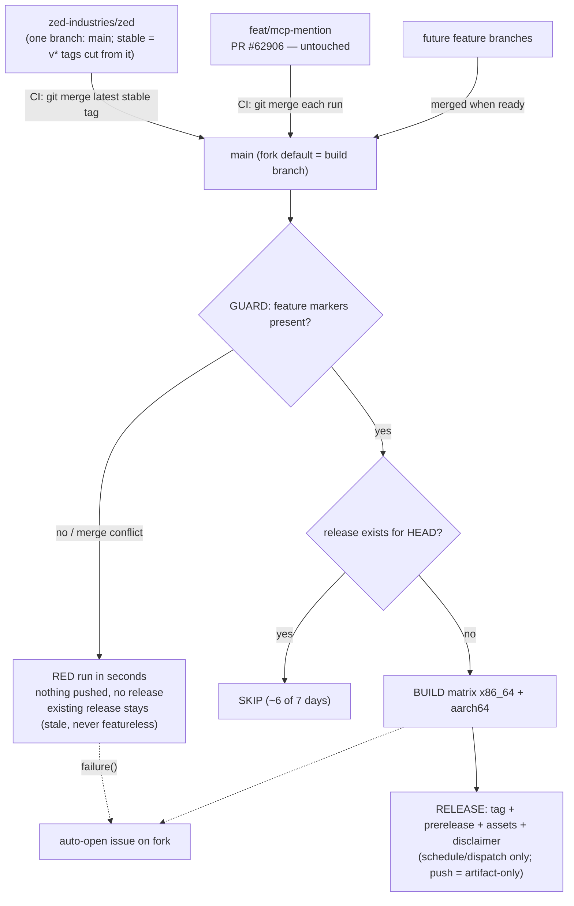

# Zed MCP Fork — GitHub Actions Build & Release Design

**Date:** 2026-10-01
**Status:** Approved (brainstorming complete; awaiting implementation plan)
**Repo:** https://github.com/Michael-Obele/zed (public fork of zed-industries/zed)
**Feature:** `@mcp` context-server mentions (PR [#62906](https://github.com/zed-industries/zed/pull/62906), commits `6bab682aec` + `01cb4e5a7c` on `feat/mcp-mention`)

---

## 1. Goals & Non-Goals

### Goals

1. **Build on GitHub, not the local machine** — GitHub Actions produces every binary; the personal machine is only for development.
2. **Always-latest Zed + always-present MCP patch** — CI syncs upstream automatically; a guard proves the feature markers exist before any expensive build runs.
3. **Downloadable Linux builds on the Releases page** — official-Zed-style install: `.tar.gz` assets + a forked `install.sh` one-liner, both architectures.
4. **In-app auto-update like main Zed** — the binary polls *our* GitHub Releases and rsync-installs updates, exactly as upstream's updater does against `cloud.zed.dev`.
5. **Legally clean** — GPL-3.0 §5 in-binary "modified" notice with date, Corresponding Source via the public repo, and an explicit "unofficial test build, not affiliated with Zed Industries" disclaimer on four surfaces (release page, README, About dialog, repo description) for trademark safety.

### Non-Goals

- Windows/macOS builds (Linux only; updater returns an error for other OSes rather than mis-install).
- `.deb`/`.rpm` packaging — **rejected deliberately**: upstream ships none, and a system-dir install breaks the in-app updater (it `rsync`s into the app folder, which a `.deb` user can't write).
- Patching `download_remote_server_release` — SSH-remote binaries keep coming from official Zed endpoints.
- Expecting PR #62906 to merge — it stays open as a contribution; the fork is the delivery vehicle.
- Rebranding the app itself — desktop IDs, folder names, and icons stay upstream-compatible (decision B: notice *inside* the app, standard paths outside).

---

## 2. Decision Log (all locked 2026-10-01)

| # | Decision | Choice | Rationale |
|---|---|---|---|
| 1 | Build location | GitHub Actions | user requirement; local machine is dev-only |
| 2 | Cadence | Daily cron (~07:10 UTC, off-hour) + `workflow_dispatch` + push→artifact-only | off-the-hour avoids GitHub's cron congestion; manual escape hatch |
| 3 | Sync owner | **CI** (plain `git merge`, never force-push) | conflicts fail loudly; releases go stale, never featureless |
| 4 | Sync source | **Latest upstream stable tag** (`v1.22.0`-style, `-pre` excluded) | user: "only merge stable"; stable ≈ weekly (v1.22.0: 2026-09-30, v1.21.0: 09-24, v1.20.x: 09-17) |
| 5 | Build branch | `main` (the fork's default branch) | no confusing words in URLs; GitHub's native Sync-fork works on it |
| 6 | PR branch | `feat/mcp-mention` **untouched** | keeps PR #62906's diff clean (7 files, +166/−2) |
| 7 | Sync sources (double) | merge stable tag **and** `origin/feat/mcp-mention` each run | PR-side fixes flow into builds; if upstream merges the PR, content dedupes cleanly |
| 8 | In-app updates | Enabled via patch of `get_release_asset()` → GitHub Releases API | "update from the UI like main Zed" |
| 9 | Architectures | x86_64 + aarch64, parallel | free ARM runners on public repos; official Zed ships both |
| 10 | Install format | `.tar.gz` + forked `install.sh` one-liner | matches main Zed byte-for-byte; `.deb` incompatible with #8 |
| 11 | Branding depth | Option **B**: release page + README + in-app About notice | GPL §5 satisfied inside the binary; hard-coded paths untouched |
| 12 | Release channel | `crates/zed/RELEASE_CHANNEL`: `dev` → **`nightly`** | only channel with SHA-based update checks (any new build = update offered); installs to `~/.local/zed-nightly.app`, never colliding with official Zed's `zed.app`; `poll_for_updates()` is `true` for every channel except `dev` |
| 13 | Tag format | `v{CARGO_PKG_VERSION}+nightly.{sha7}` | the nightly check reads the last build-metadata segment as the commit SHA |
| 14 | Failure alerting | Enable Issues on the fork; workflow auto-opens one on failure | `has_issues:false` today; red badges alone are easy to miss |
| 15 | Release retention | Keep newest 10 releases + tags, delete older | a year of dailies would otherwise accumulate |

---

## 3. Architecture: Branches & Sync



**Why merges, not rebases:** a merge can only *add* commits to `main`; it structurally cannot drop the feature commits. A conflict aborts before any push. The old local `script/sync-upstream` (rebase + force-push) would fight this model and is retired (see §8).

---

## 4. The Nightly Pipeline (workflow file: `.github/workflows/mcp-nightly.yml` — new name, zero upstream collision)

### Triggers

```yaml
on:
  schedule:
    - cron: "10 7 * * *"      # daily 07:10 UTC, off-the-hour
  workflow_dispatch:
    inputs:
      skip-sync: { type: boolean, default: false }   # rebuild without merging (post-failure retry)
      sync-ref:  { type: string,  default: "" }      # escape hatch: force main / a specific tag
  push:
    branches: [main]          # artifact-only build for testing between releases
```

### Flow (one workflow run)

1. **Checkout `main`** (full history: `fetch-depth: 0`).
2. **Resolve sync target:** `gh api repos/zed-industries/zed/releases/latest --jq .tag_name` → latest *non-prerelease* tag (`-pre` excluded by GitHub's definition). `sync-ref` input overrides. `skip-sync` skips steps 2–3 entirely but still runs guard/skip/release (lets a failed build retry without pulling upstream).
3. **Merge** the tag, then `origin/feat/mcp-mention`. Conflict → job fails, nothing pushed. Clean → `git push origin main` with `GITHUB_TOKEN` (`contents: write`); GitHub's anti-recursion rule means this push does **not** re-fire the push-triggered build.
4. **GUARD** (seconds, before any compilation) — all must hold, else fail:
   - `MentionUri::ContextServer` present in `crates/acp_thread/src/mention.rs` (MCP feature)
   - `api.github.com/repos/Michael-Obele/zed` present in `crates/auto_update/src/auto_update.rs` (updater patch)
   - `crates/zed/RELEASE_CHANNEL` == `nightly` (channel flip survived the merge)
   - `raw.githubusercontent.com/Michael-Obele/zed` in `script/install.sh` (install fork)
   - "unofficial" notice string in `crates/zed/src/zed.rs` (branding patch)
5. **Skip check:** compute `TAG = v{CARGO_PKG_VERSION}+nightly.{sha7}` for the post-merge HEAD; if a release with that tag exists → **skip build** (self-correcting: a previously *failed* build has no release, so it retries automatically; also builds immediately after any feature push once a release is due).
6. **BUILD matrix** (`ubuntu-24.04` + `ubuntu-24.04-arm`, parallel; `timeout-minutes: 300`):
   - log `df -h / /mnt` first (makes disk failures diagnosable at a glance)
   - free-disk step; set `CARGO_TARGET_DIR` on `/mnt` (`/` guarantees only 14 GB; `bundle-linux` honors `CARGO_TARGET_DIR`, verified line 49)
   - `script/linux` (apt deps incl. `musl-tools`, `gettext-base`) → `script/download-wasi-sdk`
   - per-arch `Swatinem/rust-cache`
   - **`export ZED_COMMIT_SHA=$(git rev-parse --short=7 HEAD)` — mandatory** (see §5 loop hazard)
   - `script/bundle-linux` → `target/release/zed-linux-{arch}.tar.gz` (Sentry no-ops without `sentry-cli`, verified line 97; `generate-licenses` self-installs `cargo-about`)
7. **RELEASE** (schedule/dispatch runs only; push runs upload an Actions artifact instead, 7-day retention):
   - `gh release create "$TAG" --prerelease --title … --notes-file …` with both tarballs + `sha256sums.txt`
   - body from the template in §7
8. **Retention:** list releases, delete everything beyond the newest 10 (assets + tags).
9. **On any failure:** `if: failure()` → auto-open (or comment on) an issue titled with the run/HEAD, labeled `ci-failure`.

### Failure modes (explicit)

| Failure | Behavior |
|---|---|
| Merge conflict | red run in seconds, nothing pushed, last release stays (stale-but-valid, never featureless) |
| Guard violation | red run before compilation (~seconds) |
| Disk exhaustion / build error | red run; existing release stays; next scheduled run retries (no release ⇒ not skipped) |
| Schedule delay | GitHub cron delays happen; off-minute minimizes; `workflow_dispatch` is the manual override |
| Runner/disk reality | first real run is the empirical confirmation; `df` logging + obvious failure structure per risk log |

---

## 5. Patch 1 — Updater → GitHub Releases

**File:** `crates/auto_update/src/auto_update.rs`, function `get_release_asset()` (≈ line 672)

Today: `GET cloud.zed.dev/releases/{channel}/{version}/asset?os=…` → `{version, url}` (`ReleaseAsset` is exactly those two fields, line 188).

After:

1. `GET https://api.github.com/repos/Michael-Obele/zed/releases?per_page=10` (unauthenticated; 60 req/hr is ample — polls are hours apart).
   - *Why not `/releases/latest`:* it **excludes prereleases**, and our releases are prereleases. The list endpoint is newest-first, so take the first non-draft — no heuristics.
2. Find the asset `zed-linux-{arch}.tar.gz`; **none → return Err** (macOS/Windows builds of this fork fail the update check visibly instead of installing a Linux tarball).
3. Return `ReleaseAsset { version: tag-without-`v`, url: asset.browser_download_url }` → e.g. `1.22.0+nightly.a1b2c3d`.

Also in the same file: `release_notes_url()` (line ~354) points Nightly at `github.com/zed-industries/zed/commits/nightly/` → repoint to this fork's Releases page.

### The loop hazard (why `ZED_COMMIT_SHA` is mandatory)

The nightly check (`check_if_fetched_version_is_newer`, line ~867) compares the fetched version's **last build-metadata segment** against the SHA **baked at compile time** via `option_env!("ZED_COMMIT_SHA")` (`crates/zed/src/main.rs:303`):

- Match format both sides (`{sha7}`): correct update decisions.
- `ZED_COMMIT_SHA` unset → comparison degrades to `is_none_or(…)` → *"always newer"* → **infinite re-install loop**.

Contract: CI exports `ZED_COMMIT_SHA=<short7>` **and** tags `+nightly.<short7>`; the guard asserts the env var at build start. (`bundle-linux:55` computes a `$commit` variable that it never uses — dead code upstream; we set the env ourselves.)

Install side (no patch needed): `install_release_linux` (line 1118) untars and `rsync -av --delete`s into the app folder derived from the channel → `~/.local/zed-nightly.app` (or wherever the running binary lives — custom prefixes supported). Requires `rsync` on the user's machine (one line in release notes).

---

## 6. Patch 2 — Branding + GPL §5 Notice

**a) `crates/zed/RELEASE_CHANNEL`: `dev` → `nightly`** — the switch enabling `poll_for_updates()` (`crates/release_channel/src/lib.rs:201`, false only for `Dev`), the SHA-based update path, `zed-nightly.app` install folder, and `dev.zed.Zed-Nightly` desktop ID. Upstream has committed this file exactly 3 times ever (last: 2024) → conflicts ≈ never; the guard re-verifies it post-merge anyway.

**b) About window** (`AboutWindow::new`, `crates/zed/src/zed.rs:1565`):

- `message` (line 1577): `{display_name} {version}` → `Zed Nightly 1.22.0 — unofficial MCP test build`
- new notice line: *"Modified from zed-industries/zed on {date}. Source: github.com/Michael-Obele/zed"*
- `copy_details()` (line 1592): include the notice so copied bug-report details carry it too.

This is the GPL §5 "prominent notice stating you modified it, with date" living **inside the distributed binary**.

**Deliberately untouched:** `Cargo.toml` version (upstream bumps it ~weekly → sync conflicts; irrelevant to the SHA-based update path), all hard-coded paths/IDs, app icons (upstream's, unmodified — nominative use in a clearly-labeled unofficial build, per the `zed-windows-builds` precedent).

---

## 7. Legal / Disclaimer Package

### Release body template (auto-generated every release)

```markdown
## Unofficial test build — MCP context-server mentions

**This is an automated test build of a personal fork adding `@mcp` mentions to
the Agent Panel. It is not an official Zed release.**

- **Not affiliated with, endorsed by, or connected to Zed Industries, Inc.**
  "Zed" and the Zed logo are trademarks of Zed Industries, Inc.
- Based on zed `v1.22.0` · built `2026-10-01` from [`a1b2c3d`](<link>) ·
  [source for this build](<link>) (public repo = Corresponding Source, GPL-3.0)
- Modified from zed-industries/zed; the modification is also shown in the
  app's About window.
- License: GPL-3.0 (see `licenses.md` inside the tarball)

**Install:**
`curl -f https://raw.githubusercontent.com/Michael-Obele/zed/main/script/install.sh | sh`

**In-app updates:** enabled (Settings → auto update). Requires `rsync`.

**What's in this build:** `@mcp` mention autocomplete in the Agent Panel —
attach a running MCP context server to a conversation explicitly.
```

### Coverage (trademark + GPL)

| Surface | Content |
|---|---|
| Every release page | template above (title + prerelease badge reinforce "test build") |
| README (top banner) | unofficial-test-build notice + install one-liner + build badge + link to PR #62906 |
| **In-app About window** | modified-notice + date + source (GPL §5, inside the binary) |
| Repo About description | *"Unofficial test build of Zed with MCP context-server mentions — not affiliated with Zed Industries."* |

---

## 8. Install Story

Forked `script/install.sh` (upstream's, in-repo) with minimal edits:

- download source: `cloud.zed.dev/...` → GitHub releases **list** endpoint (same prerelease trap as §5), asset `zed-linux-$(arch).tar.gz`
- default channel `nightly` → unpacks to `~/.local/zed-nightly.app`, symlinks `~/.local/bin/zed`, installs `dev.zed.Zed-Nightly.desktop` — same folder names the updater expects (all three consumers — `bundle-linux`, `install.sh`, `install_release_linux` — derive the folder from the same channel string, verified consistent)
- keep `ZED_BUNDLE_PATH` (local-tarball install) intact

**The one-liner:**

```sh
curl -f https://raw.githubusercontent.com/Michael-Obele/zed/main/script/install.sh | sh
```

All three folder-name derivations agree on `zed-nightly.app` because they all read the same channel string — that byte-compatibility is precisely why decision B avoided renaming.

---

## 9. Local & Repo Changes

| Item | Change | Why |
|---|---|---|
| `script/sync-upstream` | delete **after first successful CI sync** (it's untracked; keep as local fallback until CI is proven) | rebase + force-push fights CI's merge model |
| `script/update-patches` | re-point range `upstream/main..HEAD` → `$(latest stable tag)..HEAD` | otherwise exports 100+ upstream commits; portable patch backup stays useful |
| `build-and-clean.sh` | keep, unchanged | local dev builds; unrelated to CI |
| Fork settings | enable Issues (`gh api -X PATCH repos/Michael-Obele/zed -f has_issues=true`); set About description | failure alerts + trademark one-liner |
| Inherited workflows | audit `gh workflow list` post-bootstrap; `gh workflow disable` any with cron/ungated jobs (e.g. `release_nightly` has schedule; owner-gates cover most) | avoid red noise / queued namespace-runner jobs on the fork |
| README | IMPORTANT banner (done, 2026-10-01) + disclaimer banner + install section + badge (bootstrap) | §7 |
| Bootstrap commit on `main` | workflow file + Patches 1–2 + `RELEASE_CHANNEL` flip + `install.sh` edit + README banner + `update-patches` re-point | first CI run then merges stable tag + PR branch → guard passes → first release |

**Known accepted friction (one-line reconciliations on conflict):** upstream edits to `script/install.sh` (recent: +10 lines) and the top of `README.md` — if they change, the merge conflicts on our edit; resolution = re-apply our one-line URL swap / banner. Guard + "never release when broken" rules make a miss fail loudly rather than ship wrong.

---

## 10. Risks & Mitigations

| # | Risk | Mitigation |
|---|---|---|
| 1 | Runner disk vs Zed's `target/` (`/` guarantees 14 GB) | `CARGO_TARGET_DIR` on `/mnt` (~75 GB) + free-disk step + `df` logging first; first run = empirical confirmation |
| 2 | Infinite update loop if SHA contract breaks | `ZED_COMMIT_SHA` export + guard assertions on both sides of the contract |
| 3 | GitHub schedule delays | off-the-hour cron + `workflow_dispatch` |
| 4 | Cache size (rust-cache per arch, repo cache quota) | per-arch keys; if quota thrash appears, fall back to registry-only caching |
| 5 | Unauthenticated GitHub API rate limit (60/hr/IP) | one call per poll; polls are hours apart; failure surfaces as a visible update-check error, not corruption |
| 6 | Conflicts in our 4 touchpoints (`install.sh`, README top, About, `auto_update`) | tiny surface; guard proves markers post-merge; conflict ⇒ loud red, stale-never-featureless |
| 7 | Trade-off accepted: desktop entry still reads "Zed Nightly" (standard name for path compatibility) | trademark exposure addressed by in-app notice + release/README/repo disclaimers (decision B) |

---

## 11. Verified Evidence (file:line, checked 2026-10-01)

| Fact | Evidence |
|---|---|
| `poll_for_updates()` false only for Dev | `crates/release_channel/src/lib.rs:201-203` |
| `ReleaseAsset { version, url }` | `crates/auto_update/src/auto_update.rs:188-191` |
| cloud URL base map (`zed.dev`→`cloud.zed.dev`, other hosts passthrough) | `crates/http_client/src/http_client.rs:306-316` |
| SHA baked at compile time | `crates/zed/src/main.rs:303` (`option_env!("ZED_COMMIT_SHA")`), build id `:302` (`ZED_BUILD_ID`) |
| Version build-metadata = `{channel}[.{build_id}][.{sha}]` | `crates/release_channel/src/lib.rs` `AppVersion::load` |
| Nightly check = SHA comparison | `crates/auto_update/src/auto_update.rs` `check_if_fetched_version_is_newer` (~867) |
| Linux install = rsync into `zed-nightly.app` | `crates/auto_update/src/auto_update.rs:1118+` |
| `bundle-linux` honors `CARGO_TARGET_DIR` | `script/bundle-linux:49` |
| Sentry no-op without CLI | `script/bundle-linux:97-99` |
| licenses baked into tarball | `script/bundle-linux` (`generate-licenses` :68, copy :203) |
| `RELEASE_CHANNEL` committed 3× ever, last 2024 | `git log -- crates/zed/RELEASE_CHANNEL` |
| About window anchor | `crates/zed/src/zed.rs:1565-1605` |
| Upstream = single branch `main`; stable ≈ weekly; `-pre` interleaved | `git ls-remote --heads`, `gh release list` |
| Upstream workflows owner-gated on Namespace runners | `.github/workflows/release.yml` etc. |
| Fork: `has_issues:false`, `default_branch:main`, Actions enabled, `gh` has `workflow` scope | API checks |
| PR #62906 open/mergeable/BLOCKED-awaiting-review, CLA-signed, 0 reviews | `gh pr view` |
| No upstream `.deb`; official install = tar.gz + `install.sh` | zed.dev/docs + `grep dpkg` over `script/` |

---

## 12. Success Criteria (implementation verification)

1. Manual dispatch produces a prerelease with **both** tarballs + disclaimer body + `sha256sums.txt`.
2. The `install.sh` one-liner installs on x86_64; About dialog shows the unofficial-test-build notice with date + source URL.
3. Second release → the first build offers an in-app update; **exactly one** download per check (no loop); post-update About shows the new SHA.
4. Seeded merge conflict → red run, no push, previous release intact.
5. Seeded marker removal → guard fails within seconds, before compilation.
6. PR #62906 diff unchanged (still 7 files, +166/−2).
7. After ~10 releases, retention deletes the oldest automatically.
